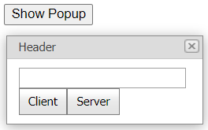

<!-- default badges list -->

[](https://supportcenter.devexpress.com/ticket/details/E3084)
[](https://docs.devexpress.com/GeneralInformation/403183)
<!-- default badges end -->
# Popup Control for ASP.NET Web Forms - How to return values from the content collection and close the pop-up window on the client or server

This example demonstrates how to add an editor to the popup control's content collection, get the editor's value, and close a pop-up window on the client or server.



## Overview

Create a popup control, use its [ContentCollection](https://docs.devexpress.com/AspNet/DevExpress.Web.ASPxPopupControlBase.Controls) property to specify the control's content, and populate a pop-up window with a text box editor and two buttons.

```aspx
<dx:ASPxPopupControl ID="popup" runat="server" ClientInstanceName="popup">
    <ContentCollection>
        <dx:PopupControlContentControl runat="server">
            <dx:ASPxTextBox ID="textBox" runat="server" ClientInstanceName="textBox" />
            <table>
                <tr>
                    <td>
                        <dx:ASPxButton ID="btnClient" runat="server" Text="Client" AutoPostBack="False" ClientInstanceName="btnClient">
                            <ClientSideEvents Click="OnBtnClientClick" />
                        </dx:ASPxButton>
                    </td>
                    <td>
                        <dx:ASPxButton ID="btnServer" runat="server" Text="Server" OnClick="btnServer_Click" />
                    </td>
                </tr>
            </table>
        </dx:PopupControlContentControl>
    </ContentCollection>
</dx:ASPxPopupControl>
```

To close the pop-up window, call the control's [Hide](https://docs.devexpress.com/AspNet/js-ASPxClientPopupControlBase.Hide) method on the client side or set the [ShowOnPageLoad](https://docs.devexpress.com/AspNet/DevExpress.Web.ASPxPopupControlBase.ShowOnPageLoad) property to `false` on the server side.

```js
function OnBtnShowPopupClick() {
    popup.Show();
}
function OnBtnClientClick(s, e) {
    popup.Hide();
    ShowInfo('Client', textBox.GetText());
}
function ShowInfo(closedBy, returnValue) {
    alert('Closed By: ' + closedBy + '\nReturn Value: ' + returnValue);
}
```
```cs
protected void btnServer_Click(object sender, EventArgs e) {
    popup.ShowOnPageLoad = false;
    string startUpScript = string.Format("ShowInfo('Server', '{0}');", textBox.Text);
    Page.ClientScript.RegisterStartupScript(this.GetType(), "ANY_KEY", startUpScript, true);
}
```
You can also get the editor's value to display it in an alert message.

## Files to Review

* [Default.aspx](./CS/WebSite/Default.aspx) (VB: [Default.aspx](./VB/WebSite/Default.aspx))
* [Default.aspx.cs](./CS/WebSite/Default.aspx.cs) (VB: [Default.aspx.vb](./VB/WebSite/Default.aspx.vb))

## More Examples

* [Popup Control for ASP.NET Web Forms - How to pass a parameter from the content to parent page](https://github.com/DevExpress-Examples/asp-net-web-forms-popup-control-pass-parameter-from-content-to-parent-page)
* [How to return values from the ASPxPopupControl's ContentUrl page and close the popup on both client and server sides](https://github.com/DevExpress-Examples/how-to-return-values-from-the-aspxpopupcontrols-contenturl-page-and-close-the-popup-on-both-e3098)
